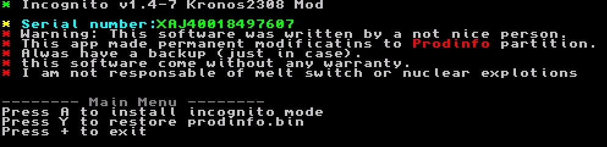

# incognito
Wipes personal information from your Nintendo Switch by removing it from prodinfo.

# purpose
a) So your switch can go online without worrying about a ban or using random dogdy DNS servers that are also likely to get you banned.

b) so malicious homebrew applications cannot steal your personal certificate.

# disclaimer
Always have a nand backup.  I am not responsible for any bricks or bans.  Use at your own risk, experimental.

This application backs up your prodinfo to the SD root, you should keep this backup in a more secure location, and not leave it on the SD card where malicious applications can read it.
